<!-- meta -->
<meta name="keywords" content="développeur fullstack, cybersécurité, react, python, portfolio, ethical hacking, dev, web dev">
<meta name="author" content="Élie du Cailar">

# 👋 Hey there, I'm Élie!

## 🚀 About Me

Passionate about the intersection of **technology**, **security**, and **creativity**, I'm a full-stack developer who transforms complex ideas into elegant digital solutions. Specialized in building high-performance web applications and securing infrastructures, I help startups and established companies in their digital transformation journey.

When I'm not coding, you'll find me crafting immersive worlds in Minecraft or exploring the latest cybersecurity vulnerabilities! 🎮🔐

*[🇫🇷 Version française disponible ici](./README.md)*

---

## 🛠️ Tech Stack

### Languages

### Frameworks & Libraries

### DevOps & Cloud

### Security & Tools

---

## 🎯 Current Projects

| 🎮 **LostHorizon** | 💼 **Awesome Readme Templates** | 🔒 **BlackBox** |
|:---:|:---:|:---:|
| Minecraft RPG mod merging magic & technology | Readme templates for github profiles | Quantum-resistant encryption platform |
| `Java` `Forge` `JSON` | `Markdown` | `React` `Cryptography` `Post-Quantum` |

### 🌟 Recent Projects

-   **🎯 BlackBox** - [Live Demo](https://blackbox-demo.vercel.app/) - Advanced text encryption platform with quantum-resistant capabilities
    -   Multi-algorithm support: AES, ChaCha20, Custom Algorithm, Kyber (post-quantum)
    -   Quantum resistance gradation from classical to post-quantum cryptography
    -   Stealth mode with secure token generation (UUID, API keys)
    -   `React` `TypeScript` `Cryptography` `Post-Quantum`

- **📜 Awesome README Templates** - [Project](https://github.com/elieduclr/Awesome-Readme-Templates) - Collection of professional README templates
    - Support for multiple profiles: Beginners, Professionals, Creatives, Technical Specialists
    - Graduated complexity from simple templates to advanced designs
    - Quick Start mode with step-by-step customization guides
    - `Markdown` `GitHub` `Badges` `Mermaid` `Portfolio`

---

## 📈 GitHub Statistics

<!--STATS-TIMESTAMP:1750815447-->

" />
" />

---

## 🎓 Continuous Learning

```mermaid
graph LR
    A[🔬 Quantum Computing] --> B[🔐 Post-Quantum Cryptography]
    C[🎮 Game Development] --> D[🏗️ Minecraft Modding]
    E[🤖 AI Security] --> F[🛡️ Adversarial ML]
    B --> G[🚀 Innovation]
    D --> G
    F --> G
```

### 📚 Current Focus
- **Post-quantum cryptography** and its impact on modern security
- **Game development** with focus on Minecraft/Forge ecosystem
- **Artificial intelligence** applied to threat detection
- **Performance optimization** for high-load web applications

---

## 🏆 Expertise

| Cybersecurity | Development | Cloud & DevOps |
|:---:|:---:|:---:|
| 🎯 Penetration Testing | ⚡ Performance Optimization | ☁️ Cloud Architecture |
| 🔐 Ethical Hacking | 🎨 UI/UX Implementation | 🔄 CI/CD Pipelines |
| 🛡️ Security Auditing | 📱 Responsive Design | 🐳 Containerization |

---

## 💬 Let's Collaborate!

I'm always open to **new opportunities**, **innovative projects**, and **collaborations** that push the boundaries of technology. Whether you need help with:

- 🚀 Building modern web applications
- 🔒 Securing your infrastructure
- 🎮 Creating unique gaming experiences
- 🤖 Integrating AI into your solutions

Feel free to reach out!

### 📫 Let's Connect

---

⭐ **If you find my projects interesting, feel free to give them a star!** ⭐

