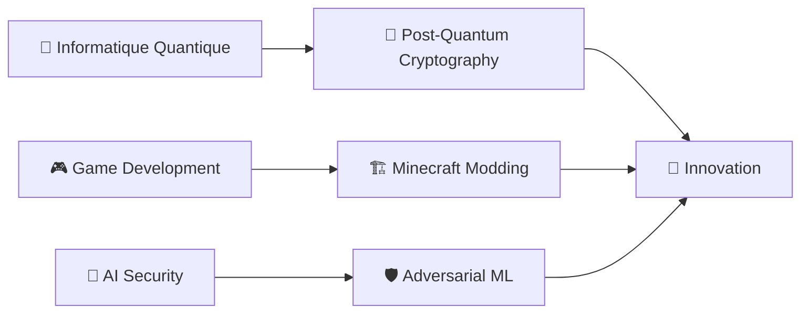

<!-- meta -->
<meta name="keywords" content="développeur fullstack, cybersécurité, react, python, portfolio, ethical hacking, dev, web dev">
<meta name="author" content="Élie du Cailar">

# 👋 Salut, moi c'est Élie !

## 🚀 À propos de moi

Passionné par l'intersection entre **technologie**, **sécurité** et **créativité**, je suis un développeur full-stack qui transforme des idées complexes en solutions digitales élégantes. Spécialisé dans la création d'applications web haute performance et la sécurisation d'infrastructures, j'accompagne startups et entreprises établies dans leur transformation numérique.

Quand je ne code pas, vous me trouverez en train de créer des univers immersifs dans Minecraft ou d'explorer les dernières vulnérabilités en cybersécurité ! 🎮🔐

*[🇬🇧 English version available here](./EN-README.md)*

---

## 🛠️ Stack Technique

### Langages

### Frameworks & Librairies

### DevOps & Cloud

### Sécurité & Outils

---

## 🎯 Projets en cours

| 🎮 **LostHorizon** | 💼 **Awesome Readme Templates** | 🔒 **BlackBox** |
|:---:|:---:|:---:|
| Mod Minecraft RPG fusionnant magie et technologie | Templates de Readme pour profils github | Plateforme de chiffrement quantum-resistant |
| `Java` `Forge` `JSON` | `Markdown` | `React` `Cryptography` `Post-Quantum` |

### 🌟 Projets récents

- **🎯 BlackBox** - [Live Demo](https://blackbox-demo.vercel.app/) - Plate-forme de chiffrement de texte avancée avec des capacités de résistance quantique
    - Prise en charge de plusieurs algorithmes : AES, ChaCha20, algorithme personnalisé, Kyber (post-quantique)
    - Graduation de la résistance quantique de la cryptographie classique à la cryptographie post-quantique
    - Mode furtif avec génération sécurisée de jetons (UUID, clés API)
    - `React` `TypeScript` `Cryptographie` `Post-Quantum`

- **📜 Awesome README Templates** - [Projet](https://github.com/elieduclr/Awesome-Readme-Templates) - Collection de templates professionnels pour README
    - Prise en charge de multiples profils : Débutants, Professionnels, Créatifs, Spécialistes techniques
    - Graduation de complexité des templates simples aux designs avancés
    - Mode "Quick Start" avec guides de personnalisation pas-à-pas
    - `Markdown` `GitHub` `Badges` `Mermaid` `Portfolio`

---

## 📈 Statistiques GitHub

<!--STATS-TIMESTAMP:1748906480-->

" />
" />

---

## 🎓 Apprentissage continu

### 📚 Focus actuel
- **Cryptographie post-quantique** et son impact sur la sécurité moderne
- **Développement de jeux** avec un focus sur l'écosystème Minecraft/Forge
- **Intelligence artificielle** appliquée à la détection de menaces
- **Optimisation des performances** pour applications web haute charge

---

## 🏆 Expertise

| Cybersécurité | Développement | Cloud & DevOps |
|:---:|:---:|:---:|
| 🎯 Penetration Testing | ⚡ Performance Optimization | ☁️ Cloud Architecture |
| 🔐 Ethical Hacking | 🎨 UI/UX Implementation | 🔄 CI/CD Pipelines |
| 🛡️ Security Auditing | 📱 Responsive Design | 🐳 Containerization |

---

## 💬 Collaborons ensemble !

Je suis toujours ouvert aux **nouvelles opportunités**, aux **projets innovants** et aux **collaborations** qui poussent les limites de la technologie. Que vous ayez besoin d'aide pour :

- 🚀 Développer une application web moderne
- 🔒 Sécuriser votre infrastructure
- 🎮 Créer des expériences de jeu uniques
- 🤖 Intégrer l'IA dans vos solutions

N'hésitez pas à me contacter !

### 📫 Restons connectés

---

⭐ **Si mes projets vous intéressent, n'hésitez pas à laisser une étoile !** ⭐

